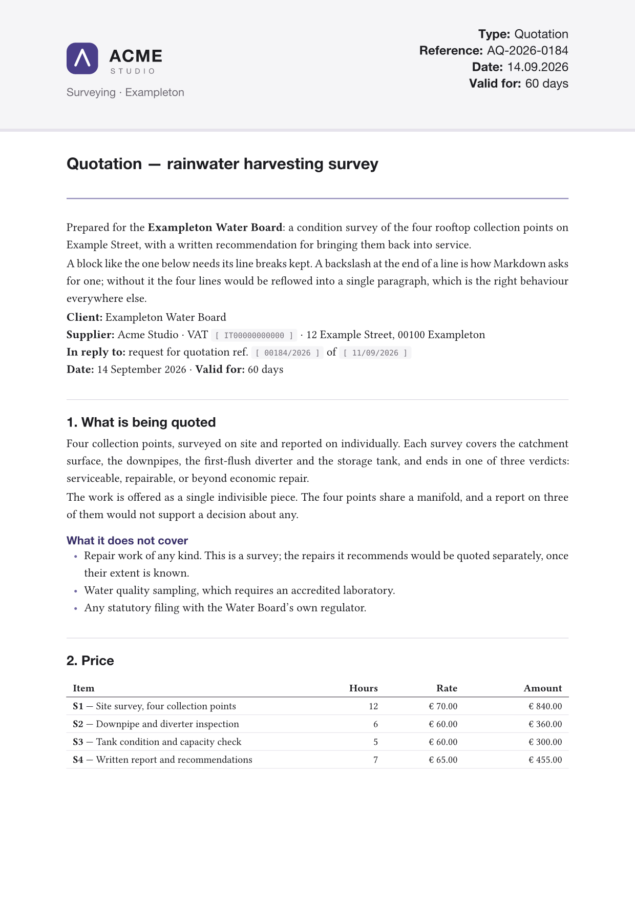
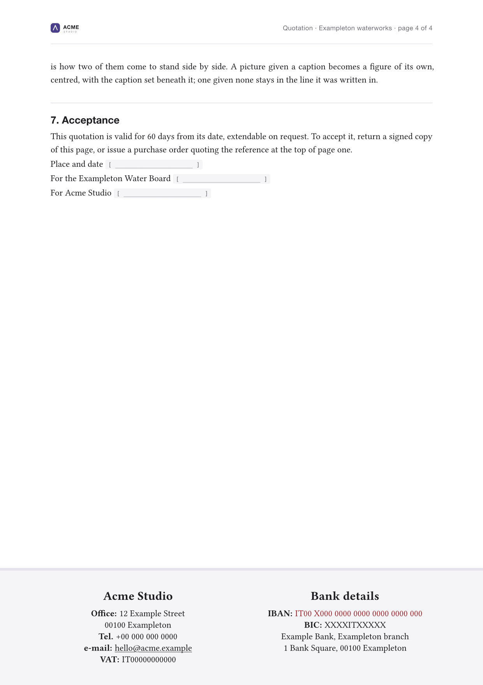
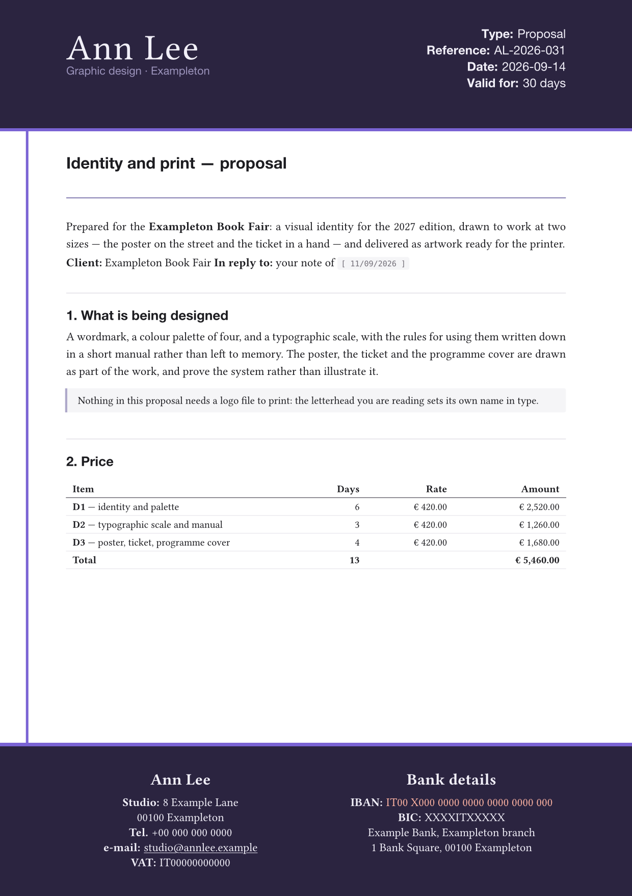
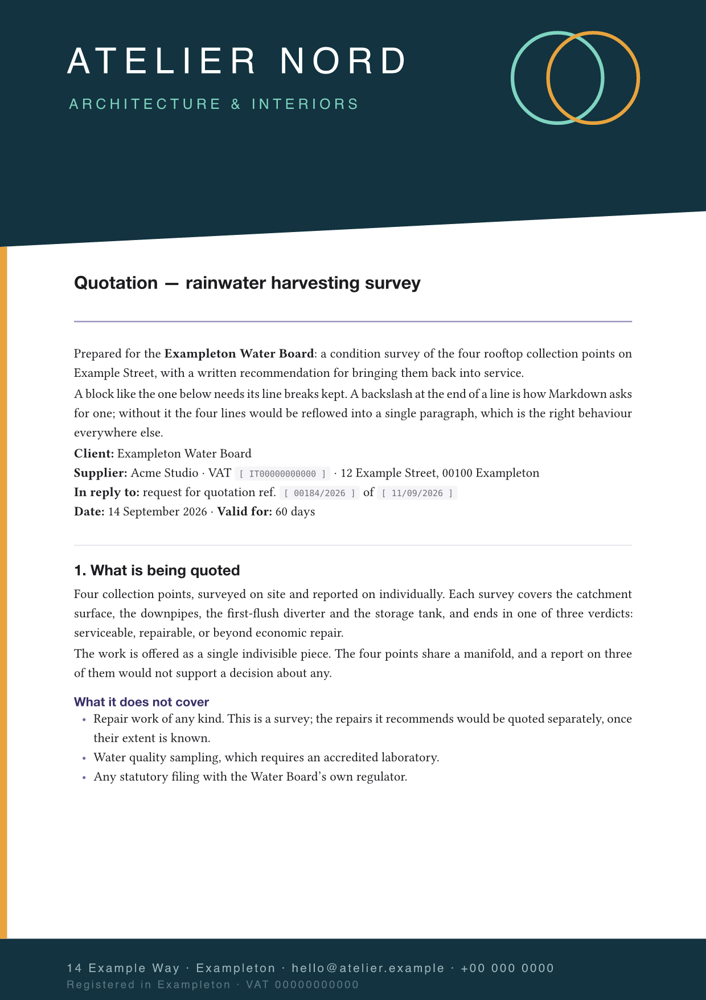
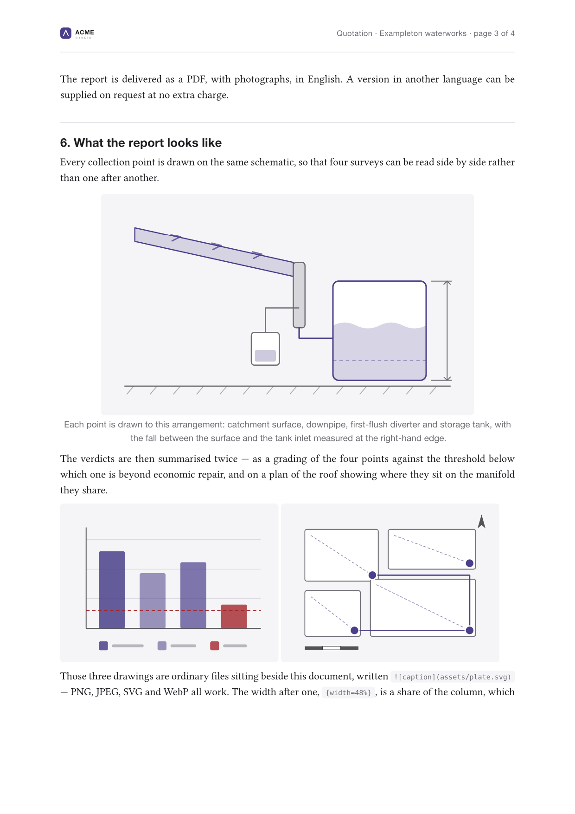
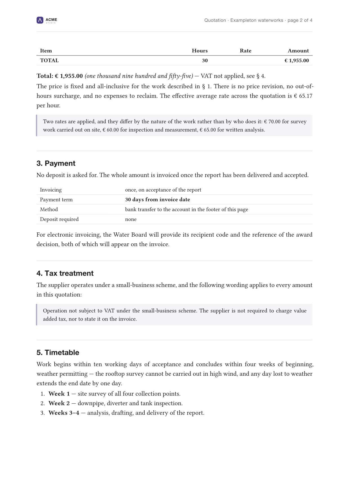

# Mela Letterhead

[](LICENSE)
[](pyproject.toml)

**Write the document in Markdown. Get it back on your own paper.** Mela
Letterhead puts a real letterhead around a Markdown file — the band across the
top of page one, the small running header on the pages after it, the footer
with your legal and banking details on the last one — and hands you a PDF.

You describe the paper once, in a single `letterhead.yaml`. Everything on it is
yours to define: how many fields sit in the header, what the footer columns say,
which colours and fonts it uses. Nothing about the layout is specific to any one
trade, country or language, and every label can be written once per language, so
the same letterhead prints an *Angebot* in German and an *offerta* in Italian
without a second configuration.

Under the hood it is [Pandoc](https://github.com/jgm/pandoc) and [Typst](https://typst.app) — so the typesetting
is real typesetting, not HTML pretending to be a page.

<p align="center">
  
</p>

---

## What you get

**One configuration, any document.** The letterhead lives in `letterhead.yaml`.
Documents are plain Markdown with a few lines of front matter, and they never
contain layout.

**Header fields you define.** Not four fixed slots — however many your paper
actually has. Each one names a key in the document's front matter, so *Date* and
*Reference* change per document while *Department* stays put. A field left empty
prints a rule to sign or fill in by hand, which is what you want for a number
that has not been issued yet.

**A footer that holds real detail.** Any number of columns, each a title and a
list of rows. E-mail addresses become links on their own; an IBAN can be picked
out in the highlight colour. The block centres itself in the band, so you can
add or remove a row without touching an offset.

**Pictures, where the text needs them.** A drawing, a plan, a photograph of the
work: `` puts it on the page — PNG, JPEG, GIF, SVG and
WebP — and `{width=48%}` beside it makes two stand side by side. A picture with
a caption becomes a figure, centred and captioned in the letterhead's own type;
one without stays in the line it was written in.

**Every language, including yours.** Any string in the configuration can be
written as a mapping from language tag to translation. A document picks its
language in its front matter, and a missing translation falls back rather than
leaving a hole in the page.

**No logo? No problem.** Nothing here needs an image. A brand with no logo file
has its name set in type instead, at the size the logo would have had, with a
face, a weight, a colour and a tagline of its own — a finished letterhead, not a
fallback. Colour the bands, put a rule down the edge of the paper, and the
letterhead is yours without a single graphic in it.
[How](#2--your-name-is-the-mark).

**Or bring paper of your own.** If a designer has already drawn your sheet,
point `page.background` at it, turn the bands off, and the tool stops building a
letterhead and starts setting Markdown onto yours.
[How](#3--you-already-have-paper).

**A PDF you can file.** `pdf.standard: a-3b` gives you PDF/A, which is what a
public administration asks for and what an archive needs: every font embedded,
nothing fetched from anywhere, the same document in ten years as today. Add
`ua-1` and it is tagged for a screen reader as well. The conformance is
enforced, not asserted — a document that would not hold up is refused rather
than written. [How](#a-pdf-you-can-file).

<p align="center">
  
</p>

---

## Installing

Mela Letterhead is a Python package, but it drives two external programs that
do the real work. Install those first:

```bash
# macOS
brew install pandoc typst

# Debian / Ubuntu
sudo apt install pandoc
cargo install --locked typst-cli   # or grab a release binary

# Windows
winget install --id JohnMacFarlane.Pandoc
winget install --id Typst.Typst
```

Then the tool itself:

```bash
pipx install mela-letterhead
```

[pipx](https://pipx.pypa.io) puts it in an environment of its own and the
`mela-letterhead` command on your PATH, which is what you want for something
you run rather than import. `pip install mela-letterhead` works too, inside a
virtual environment you have activated.

Python 3.10 or newer. The only Python dependency is PyYAML.

Pandoc 3.1 or newer and Typst 0.12 or newer. `mela-letterhead check` prints
which versions it found, and refuses one it is too old to build with rather
than letting the failure surface as a compiler error about a name Typst has
never heard of.

### From a clone

The way to work on the tool, and the way to run a change without waiting for a
release:

```bash
git clone https://github.com/melasistema/mela-letterhead.git
cd mela-letterhead

python3 -m venv .venv
source .venv/bin/activate          # Windows: .venv\Scripts\activate
pip install -e ".[dev]"
```

`-e` installs it in place, so pulling a change is enough to get it — there is
nothing to reinstall. From a clone you can also skip the console script
entirely and run `python -m mela_letterhead` instead.

---

## Quick start

```bash
mkdir ~/quotations && cd ~/quotations

mela-letterhead init .     # write a working letterhead here
mela-letterhead check      # is everything it needs present?
mela-letterhead build      # → example-letter.pdf
```

Three commands and there is a PDF on the desk. `init` writes a fully commented
`letterhead.yaml`, a placeholder `assets/logo.svg`, `example-letter.md` — a
four-page quotation for a company that does not exist, which exercises every
part of the layout — and the three drawings it prints.

`check` builds nothing, and it is the diagnostic worth running first, because it
is the only thing that tells you which fonts you actually got:

```
Toolchain
  ✓  pandoc 3.11  (developed against 3.11)
  ✓  typst 0.15.1  (developed against 0.15.1)

Configuration
  ✓  letterhead.yaml reads cleanly
     brand          Acme Studio
     language       en
     logo           assets/logo.svg
     locale packs   en

Fonts
  ✓  serif    Libertinus Serif (of 2 in the stack)
  ✓  sans     Helvetica Neue (of 5 in the stack)
  ✓  display  Libertinus Serif (of 2 in the stack)
  ✓  mono     DejaVu Sans Mono (of 3 in the stack)

Documents
  ✓  example-letter.md  [en] → example-letter.pdf

Everything checks out.
```

| Command | What it does |
| --- | --- |
| `init [dir]` | Write a working letterhead into a directory. `--force` overwrites. |
| `build [files…]` | Build documents into PDFs. `--keep-build` leaves the intermediates. |
| `check` | Report on the toolchain, configuration, fonts and documents, without building. |

`build` on its own builds every document the configuration selects; name a file
— `mela-letterhead build offer.md` — to build just that one.

---

## Three ways to start

Now make it yours, and the first decision is which of these three you are. All
three are finished letterheads. None is a lesser version of another.

### 1 · You have a logo

Drop your own file over `assets/logo.svg` — PNG and JPEG work too — and that
part is done. The mark prints in the band on page one, and smaller in the
running header on every page after it.

```yaml
brand:
  name: Acme Studio
  logo: assets/logo.svg
  tagline: Surveying · Exampleton
```

### 2 · Your name is the mark

Delete `brand.logo` and the name is set in type, at the size the logo would have
had. For a freelancer, a studio of one, or anyone whose name *is* the brand,
that is the right letterhead rather than a consolation prize:

```yaml
brand:
  name: Ann Lee
  tagline: Graphic design · Exampleton
  wordmark:
    size: 34pt
    weight: 300        # 100 thin … 400 regular … 900 black
    tracking: 1.2pt    # air between the letters
```

<p align="center">
  
</p>

The rest of the wordmark's settings are under
[a letterhead with no image in it](#a-letterhead-with-no-image-in-it).

### 3 · You already have paper

If a designer has drawn your sheet — or your printer has, and you have the
file — this turns the tool around. Point `page.background` at the artwork,
switch the tool's own furniture off, and open the margins until the body clears
your design:

```yaml
page:
  background:
    image: assets/sheet.png   # PNG or JPEG at 300 dpi — Typst places no PDF
    pages: all
  margin:
    x: 22mm
    top: 82mm
    bottom: 38mm

header:
  show: false
footer:
  show: false
running:
  show: false
```

<p align="center">
  
</p>

Nothing on that page comes from the tool but the type. Two things are worth
knowing before you export the artwork, and both are under
[Markdown onto paper you already have](#markdown-onto-paper-you-already-have).

---

## Make it yours

Whichever of the three you are, these are the settings people actually change,
about in this order:

1. **The brand.** `brand.name` and `brand.tagline` — what prints in the band.
2. **The accent colour.** `palette.accent` carries the headings, the list
   markers and the links, and it is most of what makes the paper look like
   yours.
3. **The footer.** `footer.columns` — your address, telephone, VAT number, bank
   details. Two columns give you halves, three give you thirds.
4. **The header fields.** `header.fields.items` — each one names a key in a
   document's front matter, so you choose what page one asks for.
5. **The language.** `language:` near the top of the file, and
   `documents.date_format` beneath it.
6. **The fonts,** last — and run `mela-letterhead check` afterwards, because a
   missing family is substituted silently.

Everything else has a default, so a real letterhead can be about this short:

```yaml
brand:
  name: Ann Lee
  tagline: Graphic design · Exampleton

language: en

palette:
  accent: "#2f6f4f"

footer:
  columns:
    - title: Ann Lee
      rows:
        - 12 Example Street · 00100 Exampleton
        - ["Tel.", "+00 000 000 0000"]
        - hello@annlee.example
    - title: Bank details
      rows:
        - label: "IBAN:"
          value: IT00 X000 0000 0000 0000 0000 000
          style: highlight
```

Then delete `example-letter.md`, write your own, and build. The rest of this
page is reference: you need it on the third day, not the first.

---

## Writing a document

A document is Markdown with YAML front matter:

```markdown
---
title: Quotation — rainwater harvesting survey
running-title: Quotation · Exampleton waterworks
lang: en
type: Quotation
reference: AQ-2026-0184
date: "14.09.2026"
validity: 60 days
---

# Quotation — rainwater harvesting survey

Prepared for the **Exampleton Water Board**: a condition survey of the four
rooftop collection points on Example Street.
```

Five keys belong to the tool:

| Key | Meaning |
| --- | --- |
| `title` | The document title. Falls back to the first heading, then the filename. |
| `running-title` | What the running header shows. Falls back to `title`. |
| `lang` | This document's language. Falls back to `language:` in the configuration. |
| `author` | Written into the PDF metadata. Falls back to the brand. |
| `output` | Name of the PDF to write. Falls back to the source filename. |

`running_title` and `language` are accepted as spellings of the middle two.

Everything else — `type`, `reference`, `date`, `validity` above — is **yours**,
and reaches the paper through a header field that names it. Kebab-case and
snake_case are the same key, so `valid-until` and `valid_until` both work.

> **One YAML trap worth knowing.** An unquoted `date: 2026-09-14` is read as a
> date, not as text, and gets printed through `documents.date_format`. Quote it
> — `date: "14.09.2026"` — to have it appear exactly as you typed it.

---

## The letterhead, setting by setting

`letterhead.yaml` is commented line by line, so the file itself is the reference.
What follows is the shape of it, and the handful of settings that are easier to
get wrong than to guess.

### The brand

```yaml
brand:
  name: Acme Studio
  logo: assets/logo.svg   # PNG, JPEG or SVG — delete it and read on
  tagline: { en: "Surveying · Exampleton", it: "Rilievi · Exampleton" }
```

The tagline prints under the mark on page one, under a logo just as under a
name. The running header is 26mm of paper and gets the mark alone.

#### A letterhead with no image in it

Delete `brand.logo` and the name is set in type at the size the logo would have
had — which for a freelancer, a studio of one, or anyone whose name *is* the
brand, is the right letterhead rather than a consolation:

```yaml
brand:
  name: Ann Lee
  tagline: Graphic design · Exampleton
  wordmark:
    font: ["Libertinus Serif"]   # defaults to the display stack
    size: 34pt
    weight: 300                  # 100 thin … 400 regular … 900 black
    tracking: 1.2pt              # air between the letters
    align: left
```

Every measurement here is really a **share of the width the mark occupies**, so
the smaller mark in the running header is the same design rather than another
one. Write `0.17`, `17%` or `34pt` — a length is read as a share of
`header.logo.width` and behaves the same way.

The one setting to leave alone at first is `color`. Left out, the wordmark
follows the ink of whatever it is printed on: the header band on page one, the
bare paper in the running header. Set it, and that one colour is used in both
places — which is how a white wordmark disappears on page two.

### Colour and type

```yaml
palette:
  band: "#f5f5f7"       # the header and footer bands
  rule: "#e6e3ec"       # the thin line along a band's inner edge
  accent: "#4a3f8a"     # headings, list markers, links
  ink: "#1c1c20"
  muted: "#6f6b74"
  highlight: "#a4262c"  # the one footer row that has to catch the eye
  hairline: "#dcd9e2"

fonts:
  serif: ["Libertinus Serif", "New Computer Modern"]
  sans: ["Helvetica Neue", "Inter", "Arial", "Liberation Sans", "DejaVu Sans"]
  mono: ["DejaVu Sans Mono", "Menlo", "Consolas"]
```

Change `accent` first: it carries the headings, the list markers and the links,
and it is most of what makes the paper look like yours.

Each font entry is a fallback stack — the first one installed wins. Typst
carries Libertinus Serif and DejaVu Sans Mono inside itself, so those resolve on
any machine; it carries no sans face, which is why that stack names what macOS,
Windows and the common Linux font packages provide in turn. **When nothing in a
stack is installed, Typst substitutes silently and your page changes without
saying so** — `mela-letterhead check` tells you which font you are actually
getting. To ship fonts with the project, put them in a directory and point
`fonts.paths` at it.

#### Giving a band real colour

`palette.band` is shared: it fills the header band, the footer band, the block
quotations and the code. That is right while it stays pale, and wrong the moment
you want a strong header — write `palette.band: "#2b2440"` and the quotations go
dark with it. So each band carries its own colours instead, each falling back to
the palette when you leave it out:

```yaml
header:
  fill: "#2b2440"       # the ground
  ink: "#f3f1fa"        # the fields printed on it
  muted: "#9d95bd"      # the rule printed where a field has no value
  rule_color: "#7a63d4" # the line along the lower edge

footer:
  fill: "#2b2440"
  ink: "#f3f1fa"
  muted: "#9d95bd"
  highlight: "#ffb4a2"  # the row that has to catch the eye
  rule_color: "#7a63d4"
```

Set `fill` dark and you want `ink` pale to go with it. The wordmark follows
`header.ink` on its own.

#### A border around the paper

```yaml
page:
  border:
    width: 2.4pt
    color: "#4a3f8a"    # defaults to the accent colour
    inset: 9mm          # from the edge of the paper
    sides: left         # all · left · right · top · bottom · x · y · none
```

Nought width — the default — draws nothing. A single line down one side is the
quietest version and usually the best; `sides` also takes a list, `[left,
bottom]`. The border is drawn on every page and *under* the bands, so a
full-bleed band interrupts it rather than being crossed by it.

#### Markdown onto paper you already have

The whole of it, with the two settings the
[third way to start](#3--you-already-have-paper) left out:

```yaml
page:
  background:
    image: assets/sheet.png
    fit: cover      # or contain
    pages: all      # first · rest · all
    veil: 0         # white laid over it, 0 to 1
```

`pages: first` prints the sheet on page one alone, which is what a designed
first page and a plainer continuation sheet want; `rest` is the other half of
that pair, and `all` puts it on every page.

The background is read relative to `letterhead.yaml`, like the logo and unlike a
picture in the body — it belongs to the paper, not to anything written on it.
It is drawn under everything, so you can leave the bands on and put a texture or
a watermark behind them if that is what you want; `veil` is there for exactly
that case.

Two things worth knowing before you export:

- **Typst places PNG, JPEG and SVG, and no PDF.** A sheet drawn in Illustrator
  or InDesign has to be exported raster — 300 dpi for print, which is about
  2480 × 3508 for A4. The file is embedded in every PDF built from it, so a
  40 MB export becomes a 40 MB letter.
- **`veil` is a white rectangle, not an opacity.** Typst has no image opacity,
  so paling a background means covering it. That works on white paper and
  nowhere else: on a coloured or dark sheet a veil will fog the design rather
  than soften it, and the answer there is to export the artwork already pale.

`fit: cover` fills the paper and crops whatever will not fit; `fit: contain`
fits the whole picture inside it and leaves paper showing where the proportions
disagree. Export at the page's own proportions and the two are the same thing.

### Header fields

```yaml
header:
  fields:
    when_empty: rule      # or `blank`, or `hide`
    items:
      - key: type
        label: { en: "Type:", it: "Tipologia:", de: "Art:" }
      - key: reference
        label: { en: "Reference:", it: "Codice:", de: "Kennzeichen:" }
      - key: date
        label: { en: "Date:", it: "Data:", de: "Datum:" }
```

`key` names a front-matter key. Use `value:` instead for something that never
changes. Punctuation belongs in the label, because languages do not agree on
where it goes — `Date:` in English, `Date :` in French.

`when_empty` decides what a field with no value becomes: a `rule` to fill in by
hand, a `blank` label, or nothing at all (`hide`).

### The footer

```yaml
footer:
  pages: last            # or `all`
  columns:
    - title: { en: Acme Studio }
      rows:
        - label: { en: "Office:", it: "Sede:" }
          value: 12 Example Street
        - 00100 Exampleton                    # a line with no label
        - ["Tel.", "+00 000 000 0000"]        # a label and a value
        - hello@acme.example                  # becomes a mailto: link
    - title: { en: Bank details }
      rows:
        - label: "IBAN:"
          value: IT00 X000 0000 0000 0000 0000 000
          style: highlight
```

Columns are laid out evenly, so two give you halves and three give you thirds.
Column titles line up across the band even when one column runs longer than its
neighbour, and the whole block centres itself in the band's height.

---

## A PDF you can file

By default you get an ordinary PDF, which is what a letter is. Set
`pdf.standard` when somebody at the other end has asked for something in
particular.

```yaml
pdf:
  standard: a-3b           # or a list: [a-3b, ua-1]
```

**PDF/A** is the archival form: every font embedded, no colour that depends on
a profile the reader does not have, nothing fetched from outside. It is what a
public administration usually means by "send it as a PDF", and what makes a
document still open the same way in ten years. `a-2b` and `a-3b` are the two in
common use — A-3 differs from A-2 only in allowing a file to be attached inside
the PDF, which is how an electronic invoice carries its XML. `a-4` is the newer
PDF 2.0 edition.

**PDF/UA-1** is the accessible form: the page is tagged so that a screen reader
can follow it in reading order rather than guessing from where the ink sits, and
every picture carries a description. The two can be asked for together —
`[a-3b, ua-1]` is a document that is both filed and readable — with the one
exception that `a-4` and `ua-1` cannot be combined, because A-4 is PDF 2.0 and
UA-1 is not.

A PDF/A part before 4 comes in conformance levels, each adding to the one below
it:

| | what it guarantees |
|---|---|
| `a-1b` `a-2b` `a-3b` — level **b**, basic | the document looks the same anywhere, for ever |
| `a-2u` `a-3u` — level **u**, unicode | and its text can be extracted and searched |
| `a-1a` `a-2a` `a-3a` — level **a**, accessible | and it is tagged and described, as PDF/UA asks |
| `a-4` `a-4f` `a-4e` | PDF/A-4 has no levels: `a-4f` additionally allows attached files, `a-4e` is the engineering flavour |
| `ua-1` | tagging and descriptions, alongside any PDF version up to 1.7 |

Typst enforces conformance and refuses a document that would not hold up, so a
file that comes out is a file that passed. Two things it refuses are worth
knowing in advance:

- **Every picture needs a description** under `ua-1` and the `a` levels. That is
  what goes in the square brackets: ``. A picture standing alone in its paragraph also prints
  those words as its caption; two side by side print nothing and are described
  all the same. Say what the picture says, not that there is a picture.
- **PDF/A-1 allows no transparency**, because it is built on PDF 1.4, which had
  none. A logo or a drawing exported with a soft shadow or a partly transparent
  fill will be refused. This is the one standard here that may need the artwork
  changed rather than the configuration; `a-2b` is the same idea without the
  restriction, and is what almost everybody means.

Two footnotes about the toolchain, both of which `mela-letterhead check`
reports:

- Descriptions are carried from your Markdown into the page by Pandoc, and only
  from **Pandoc 3.9.0.1** onward. An older one drops them silently, so the
  document is then refused for missing what it plainly has. `check` says so
  rather than letting you find out that way.
- The full set of standards above needs **Typst 0.14**; 0.12 knows only `a-2b`
  and 0.13 adds `a-3b`.

Under `ua-1` the footer band stops linking. A band is drawn as a page artifact —
furniture rather than content — and PDF/UA-1 allows no link inside one, so the
e-mail address and any `link:` you wrote print as plain text. Nothing moves on
the page; the underline goes, because an underline that is not a link is a lie
about the page.

---

## Languages

This is the part worth reading twice, because it is what separates this from a
template with your address hard-coded into it.

**Anything you write can be written per language.** Wherever a string is
expected, a mapping from language tag to translation is accepted instead:

```yaml
label: Reference                                    # one language
label: { en: Reference, it: Codice, de: Kennzeichen }   # several
```

A mapping is read as a translation table when *every* one of its keys looks like
a language tag (`en`, `pt-BR`, `de_AT`) — so `{ width: 67mm, y: 11.8mm }` stays
a pair of settings.

**A document picks its own language.** `lang: de` in the front matter, and the
whole letterhead comes out in German: field labels, footer titles, footer rows,
even the logo if you gave a different one per market. Without `lang`, the
document uses `language:` from the configuration.

**A missing translation falls back rather than leaving a hole.** The chain runs
from the document's language, through its bare language subtag, to the project
default, to English — so a footer you have translated into German and a column
title you have not will still both print.

**The tool's own strings live in locale packs.** There is only one at the
moment — the running header — and English ships with the package. To add a
language, drop a file beside your `letterhead.yaml`:

```yaml
# locales/de.yaml
running_header: "{title} · Seite {page} von {pages}"
untitled: "Unbenanntes Dokument"
```

No code changes, no rebuild, nothing to submit upstream. A project pack also
overrides the built-in one for the same language, so you can correct a shipped
string without forking anything. `mela-letterhead check` lists what it found.

Placeholders available to `running_header` are `{title}`, `{brand}`, `{page}`
and `{pages}`.

Typst is told the document's language too, so hyphenation and quotation marks
follow it — Italian gets its curly apostrophes, German its hyphenation rules.

---

## Markdown conventions

Ordinary Markdown works. Five things are worth knowing about how it lands on
paper.

**Tables.** Write the separator row lazily — `|---|---:|` — and let the tool
size the columns. Pandoc derives a Typst column's width from how many dashes you
typed, which would otherwise give a column holding the word "Hours" the same
width as one holding a sentence. Widths are recomputed from the content, your
`:` alignment markers are kept, and the header row is emboldened for you.

**Horizontal rules.** `---` between sections is dropped in print: the hierarchy
is already carried by the rules above the headings, and a full-width line on top
of that reads as heavy. Keep them in the source if they help you write.

**Inline code** becomes a grey field — the convention for a value left to be
filled in later:

```markdown
In reply to request ref. `[ 00184/2026 ]` of `[ 11/09/2026 ]`

Place and date `[ ______________________ ]`
```

**Block quotations** become a tinted box with an accent rule down the left, which
suits a statutory wording or a note that has to stand apart.

Each of those four can be switched off under `markdown:` in the configuration.

**Pictures** are written the ordinary way, and the file is read relative to the
document that names it:

```markdown
{width=82%}

{width=48%} {width=48%}
```

PNG, JPEG, GIF, SVG and WebP are what Typst can place; anything else is refused
by name before the compile starts, as is a picture that is not there and a URL,
which the tool will not go and fetch. The width after a picture is a share of
the column — which is what puts two of them side by side, as in the second line
above.

What you write in the square brackets is read two ways at once. A picture
standing alone in its paragraph becomes a **figure** — a block of its own,
centred, with those words set underneath in the sans face as the caption. Two
written side by side, as in the second line above, stay inline in the paragraph
and print nothing. Either way the words are carried into the PDF as the
picture's **description**, which is what a screen reader announces in place of
it and what [`pdf.standard`](#a-pdf-you-can-file) requires under PDF/UA-1. So
they are worth writing even where they will not be seen.

The rest is `images:` in the configuration:

| Setting | Does |
| --- | --- |
| `width` | Width of a picture that gives none of its own. `auto` keeps its natural size, shrinking it to the column when it is wider; `70%` applies to every picture that does not say otherwise. |
| `align` | Where a figure sits in the column. |
| `frame` | A hairline around the picture, for artwork that runs pale at the edges. |
| `numbered` | `true` prints "Figure 1: …", in the document's language. |
| `caption.size`, `caption.gap` | The caption's type size, and its distance from the picture. |

One caveat if you draw in SVG: text in an SVG file is set in whatever font the
machine compiling it has, so a drawing built from live text shifts between
computers. Convert the lettering to paths, or leave it to the caption, where it
is typeset with the rest of the document.

**Anything else Pandoc can do.** `markdown.extra_args` is appended to the
Pandoc command line, which is the escape hatch for a reader extension, a
bibliography, a Lua filter of your own:

```yaml
markdown:
  extra_args: ["--citeproc", "--bibliography=references.bib"]
```

Worth knowing what that means: `--lua-filter`, `--filter` and `-F` name
programs, and Pandoc runs them. A `letterhead.yaml` carrying those is
executable configuration, so treat one you did not write the way you would
treat a script somebody sent you — read it before you build with it. Everything
else in this file only describes a page.

<p align="center">
  
</p>

Paragraphs are reflowed to the column, which is what you want for prose. When a
block genuinely needs its line breaks — an address, a list of parties — end each
line with a backslash:

```markdown
**Client:** Exampleton Water Board\
**Supplier:** Acme Studio · VAT `[ IT00000000000 ]`\
**Date:** 14 September 2026
```

If you write one sentence per line and want every break honoured, set
`markdown.format: markdown+hard_line_breaks` instead.

<p align="center">
  
</p>

---

## How it works

```
your-document.md
      │
      │  front matter split off, language chosen
      ▼
letterhead.yaml ──► resolved into document.json   (one language, lengths in points)
      │
      │  table widths recomputed, rules dropped
      ▼
  body.prep.md
      │
      │  pandoc --to typst, pictures copied in beside it
      ▼
  document.typ ──► letterhead.typ ──► typst compile ──► your-document.pdf
```

Each document is built in its own directory under `.letterhead-build/`, into
which everything it needs is copied first — the Typst module, the logo, the
pictures the document names, the resolved configuration. That costs a few
kilobytes and buys two things: Typst compiles with its root set to a directory
holding nothing but this document, and you can read the directory afterwards to
see exactly what was handed to the compiler.

```bash
mela-letterhead build --keep-build
cat .letterhead-build/example-letter/document.json
```

Nothing in there is an input. Deleting it loses nothing.

The division of labour is deliberate: **all** resolution — language, units,
defaults, validation — happens in Python, and `letterhead.typ` receives a
finished structure with one language chosen and every length already a number of
points. The Typst module contains no brand, no language and no document, which
is why it never needs editing to print somebody else's paper.

### Project layout

```
src/mela_letterhead/
  cli.py                  the three commands
  config.py               letterhead.yaml → the resolved structure
  document.py             front matter, titles, discovery
  i18n.py                 language maps, fallback chains, locale packs
  markdown_prep.py        table widths, rules, header rows
  builder.py              the pipeline
  toolchain.py            finding and running pandoc and typst
  units.py                lengths, colours, page sizes
  locales/en.yaml         the strings the tool writes itself
  assets/
    letterhead.typ        the layout — brand-free, language-free
    pandoc-typst.template
    scaffold/             what `init` copies out
```

---

## When something looks wrong

**The page compiled but the type looks off.** Almost always a font. Typst
substitutes a missing family without failing, so run `mela-letterhead check` and
look at the Fonts section for what it actually resolved.

**A setting seems to be ignored.** It probably is — and the tool will say so.
Unknown keys are refused by name, with the nearest valid one suggested:

```
Error: letterhead.yaml: unknown setting 'palete'

  Did you mean 'palette'?
```

**A picture is refused, or lands somewhere you did not expect.** Its path is
read relative to the document that names it — not to `letterhead.yaml`, which is
where the logo's and the background's paths are read from.
`mela-letterhead build --keep-build` leaves
every picture the document used in `.letterhead-build/<document>/images/`, which
is exactly what the compiler was given.

**The block quotations went dark along with the header band.** `palette.band`
fills four things — both bands, the quotations and the code. Colour the band
itself with `header.fill` and `footer.fill`, and leave the palette pale.

**The wordmark is invisible on page two.** It was given a `color` of its own,
and that one colour is used on both grounds — the header band and the bare paper
of the running header. Delete `brand.wordmark.color` and it follows each of them
instead.

**The background sheet is refused.** If the message says Typst cannot place a
`.pdf`, that is the usual one: export the artwork as PNG or JPEG instead. If it
says the file does not exist, remember that this path is read relative to
`letterhead.yaml` and not to the document — `mela-letterhead check` prints the
file it resolved to.

**The text is sitting on top of the artwork.** Nothing measures your sheet for
you; the tool only knows the margins you gave it. Raise `page.margin.top` until
the body clears the design, and `page.margin.bottom` until it clears the foot.

**A document ends on a page holding nothing but the bands.** The footer reserves
its room at the end of the body. Trim the text, or raise `page.margin.bottom`.

**A standard is refused for missing alt text the document has.** Check the
Pandoc version. Below 3.9.0.1 the Typst writer drops a picture's description on
the way, so what you wrote never reaches the page and the compiler is telling
you the truth about a document it never saw whole. `mela-letterhead check` says
this outright when `pdf.standard` asks for `ua-1` or an `a` level.

**A standard is refused and the message names no picture.** It will now — the
error carries the file names that carry no description, which Typst's own
message does not. If it names none at all, the description is somewhere the
tool did not look; write it in the square brackets rather than in raw Typst.

**A table column is too narrow for a long unbroken value.** IBANs and reference
numbers cannot be hyphenated in any language; the width calculation already
accounts for the longest word in a column, but you can turn the whole thing off
with `markdown.rewrite_table_widths: false` and set the dashes yourself.

**`on:` in YAML is the boolean true.** This is why the footer setting is spelled
`pages: last` and not `on: last`. Worth remembering if you add settings of your
own.

---

## Development

```bash
python3 -m venv .venv
source .venv/bin/activate
pip install -e ".[dev]"

pytest              # the suite
ruff check src tests
mypy                # strict, against the 3.10 the package claims
```

The suite covers unit conversion, language resolution, front matter, the
Markdown preparation and configuration validation, and finishes with end-to-end
builds that run the real Pandoc and the real Typst. Those last ones skip
themselves when either program is missing, so you can work on the rest without
the toolchain installed.

Contributions are welcome, and [CONTRIBUTING.md](CONTRIBUTING.md) is the short
version of how: the commit grammar, and the three edits a new setting needs.
Code, comments and documentation are in English; only the text that appears on a
user's letterhead is translated.

---

## License

Mela Letterhead is open source under the **MIT License** — free to use, modify
and adapt. See [LICENSE](LICENSE) for the full text.

The scaffolded example is a fictional company. Replace it with your own details
before you send anything to anybody.

© 2026 Luca Visciola (Melasistema)
