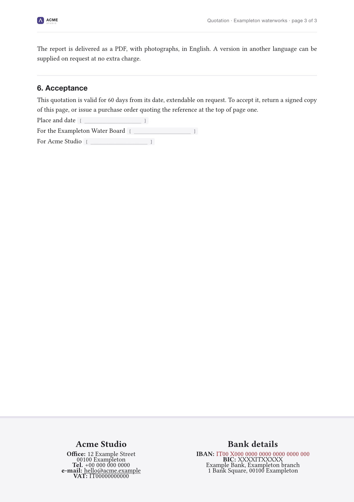

# Mela Letterhead

[](LICENSE)
[](pyproject.toml)

**Write the document in Markdown. Get it back on your own paper.** Mela
Letterhead puts a real letterhead around a Markdown file — the band across the
top of page one, the small running header on the pages after it, the footer
with your legal and banking details on the last one — and hands you a PDF.

You describe the paper once, in a single `letterhead.yaml`. Everything on it is
yours to define: how many fields sit in the header, what the footer columns say,
which colours and fonts it uses. Nothing about the layout is specific to any one
trade, country or language, and every label can be written once per language, so
the same letterhead prints an *Angebot* in German and an *offerta* in Italian
without a second configuration.

Under the hood it is Pandoc and [Typst](https://typst.app) — so the typesetting
is real typesetting, not HTML pretending to be a page.

<p align="center">
  
</p>

---

## What you get

**One configuration, any document.** The letterhead lives in `letterhead.yaml`.
Documents are plain Markdown with a few lines of front matter, and they never
contain layout.

**Header fields you define.** Not four fixed slots — however many your paper
actually has. Each one names a key in the document's front matter, so *Date* and
*Reference* change per document while *Department* stays put. A field left empty
prints a rule to sign or fill in by hand, which is what you want for a number
that has not been issued yet.

**A footer that holds real detail.** Any number of columns, each a title and a
list of rows. E-mail addresses become links on their own; an IBAN can be picked
out in the highlight colour. The block centres itself in the band, so you can
add or remove a row without touching an offset.

**Every language, including yours.** Any string in the configuration can be
written as a mapping from language tag to translation. A document picks its
language in its front matter, and a missing translation falls back rather than
leaving a hole in the page.

**No logo? No problem.** A brand with no logo file gets its name set as a
typographic wordmark, measured and scaled to occupy exactly the width the logo
would have.

<p align="center">
  
</p>

---

## Installing

Mela Letterhead is a Python package, but it drives two external programs that
do the real work. Install those first:

```bash
# macOS
brew install pandoc typst

# Debian / Ubuntu
sudo apt install pandoc
cargo install --locked typst-cli   # or grab a release binary

# Windows
winget install --id JohnMacFarlane.Pandoc
winget install --id Typst.Typst
```

Then the tool itself, in a virtual environment:

```bash
git clone https://github.com/melasistema/mela-letterhead.git
cd mela-letterhead

python3 -m venv .venv
source .venv/bin/activate          # Windows: .venv\Scripts\activate
pip install -e .
```

That gives you a `mela-letterhead` command for as long as the environment is
active. `pip install -e .` installs it in place, so pulling a change is enough
to get it — there is nothing to reinstall.

From a clone you can also skip the console script entirely and run
`python -m mela_letterhead` instead.

Python 3.9 or newer. The only Python dependency is PyYAML.

---

## Getting started

```bash
mkdir ~/quotations && cd ~/quotations
mela-letterhead init .
```

That writes three files: a fully commented `letterhead.yaml`, a placeholder
`assets/logo.svg`, and `example-letter.md` — a three-page quotation for a
company that does not exist, which exercises every part of the layout.

Check that everything it needs is present:

```bash
mela-letterhead check
```

```
Toolchain
  ✓  pandoc 3.11  (developed against 3.11)
  ✓  typst 0.15.1  (developed against 0.15.1)

Configuration
  ✓  letterhead.yaml reads cleanly
     brand          Acme Studio
     language       en
     logo           assets/logo.svg
     locale packs   en

Fonts
  ✓  serif    Libertinus Serif (of 2 in the stack)
  ✓  sans     Helvetica Neue (of 5 in the stack)
  ✓  display  Libertinus Serif (of 2 in the stack)
  ✓  mono     DejaVu Sans Mono (of 3 in the stack)

Documents
  ✓  example-letter.md  [en] → example-letter.pdf

Everything checks out.
```

Then build:

```bash
mela-letterhead build              # every document the configuration selects
mela-letterhead build offer.md     # just this one
```

Now make it yours: drop your own logo over `assets/logo.svg`, change
`brand.name` and `palette.accent`, and replace the footer columns with your real
details.

### The three commands

| Command | What it does |
| --- | --- |
| `init [dir]` | Write a working letterhead into a directory. `--force` overwrites. |
| `build [files…]` | Build documents into PDFs. `--keep-build` leaves the intermediates. |
| `check` | Report on the toolchain, configuration, fonts and documents, without building. |

---

## Writing a document

A document is Markdown with YAML front matter:

```markdown
---
title: Quotation — rainwater harvesting survey
running-title: Quotation · Exampleton waterworks
lang: en
type: Quotation
reference: AQ-2026-0184
date: "14.09.2026"
validity: 60 days
---

# Quotation — rainwater harvesting survey

Prepared for the **Exampleton Water Board**: a condition survey of the four
rooftop collection points on Example Street.
```

Five keys belong to the tool:

| Key | Meaning |
| --- | --- |
| `title` | The document title. Falls back to the first heading, then the filename. |
| `running-title` | What the running header shows. Falls back to `title`. |
| `lang` | This document's language. Falls back to `language:` in the configuration. |
| `author` | Written into the PDF metadata. Falls back to the brand. |
| `output` | Name of the PDF to write. Falls back to the source filename. |

`running_title` and `language` are accepted as spellings of the middle two.

Everything else — `type`, `reference`, `date`, `validity` above — is **yours**,
and reaches the paper through a header field that names it. Kebab-case and
snake_case are the same key, so `valid-until` and `valid_until` both work.

> **One YAML trap worth knowing.** An unquoted `date: 2026-09-14` is read as a
> date, not as text, and gets printed through `documents.date_format`. Quote it
> — `date: "14.09.2026"` — to have it appear exactly as you typed it.

---

## Describing the letterhead

`letterhead.yaml` is commented line by line, and every setting has a default, so
a working configuration can be as short as a brand name. What follows is the
shape of it rather than the whole reference.

### The brand

```yaml
brand:
  name: Acme Studio
  logo: assets/logo.svg   # PNG, JPEG or SVG — delete for a wordmark instead
```

### Colour and type

```yaml
palette:
  band: "#f5f5f7"       # the header and footer bands
  rule: "#e6e3ec"       # the thin line along a band's inner edge
  accent: "#4a3f8a"     # headings, list markers, links
  ink: "#1c1c20"
  muted: "#6f6b74"
  highlight: "#a4262c"  # the one footer row that has to catch the eye
  hairline: "#dcd9e2"

fonts:
  serif: ["Libertinus Serif", "New Computer Modern"]
  sans: ["Helvetica Neue", "Inter", "Arial", "Liberation Sans", "DejaVu Sans"]
  mono: ["DejaVu Sans Mono", "Menlo", "Consolas"]
```

Change `accent` first: it carries the headings, the list markers and the links,
and it is most of what makes the paper look like yours.

Each font entry is a fallback stack — the first one installed wins. Typst
carries Libertinus Serif and DejaVu Sans Mono inside itself, so those resolve on
any machine; it carries no sans face, which is why that stack names what macOS,
Windows and the common Linux font packages provide in turn. **When nothing in a
stack is installed, Typst substitutes silently and your page changes without
saying so** — `mela-letterhead check` tells you which font you are actually
getting. To ship fonts with the project, put them in a directory and point
`fonts.paths` at it.

### Header fields

```yaml
header:
  fields:
    when_empty: rule      # or `blank`, or `hide`
    items:
      - key: type
        label: { en: "Type:", it: "Tipologia:", de: "Art:" }
      - key: reference
        label: { en: "Reference:", it: "Codice:", de: "Kennzeichen:" }
      - key: date
        label: { en: "Date:", it: "Data:", de: "Datum:" }
```

`key` names a front-matter key. Use `value:` instead for something that never
changes. Punctuation belongs in the label, because languages do not agree on
where it goes — `Date:` in English, `Date :` in French.

`when_empty` decides what a field with no value becomes: a `rule` to fill in by
hand, a `blank` label, or nothing at all (`hide`).

### The footer

```yaml
footer:
  pages: last            # or `all`
  columns:
    - title: { en: Acme Studio }
      rows:
        - label: { en: "Office:", it: "Sede:" }
          value: 12 Example Street
        - 00100 Exampleton                    # a line with no label
        - ["Tel.", "+00 000 000 0000"]        # a label and a value
        - hello@acme.example                  # becomes a mailto: link
    - title: { en: Bank details }
      rows:
        - label: "IBAN:"
          value: IT00 X000 0000 0000 0000 0000 000
          style: highlight
```

Columns are laid out evenly, so two give you halves and three give you thirds.
Column titles line up across the band even when one column runs longer than its
neighbour, and the whole block centres itself in the band's height.

---

## Languages

This is the part worth reading twice, because it is what separates this from a
template with your address hard-coded into it.

**Anything you write can be written per language.** Wherever a string is
expected, a mapping from language tag to translation is accepted instead:

```yaml
label: Reference                                    # one language
label: { en: Reference, it: Codice, de: Kennzeichen }   # several
```

A mapping is read as a translation table when *every* one of its keys looks like
a language tag (`en`, `pt-BR`, `de_AT`) — so `{ width: 67mm, y: 11.8mm }` stays
a pair of settings.

**A document picks its own language.** `lang: de` in the front matter, and the
whole letterhead comes out in German: field labels, footer titles, footer rows,
even the logo if you gave a different one per market. Without `lang`, the
document uses `language:` from the configuration.

**A missing translation falls back rather than leaving a hole.** The chain runs
from the document's language, through its bare language subtag, to the project
default, to English — so a footer you have translated into German and a column
title you have not will still both print.

**The tool's own strings live in locale packs.** There is only one at the
moment — the running header — and English ships with the package. To add a
language, drop a file beside your `letterhead.yaml`:

```yaml
# locales/de.yaml
running_header: "{title} · Seite {page} von {pages}"
untitled: "Unbenanntes Dokument"
```

No code changes, no rebuild, nothing to submit upstream. A project pack also
overrides the built-in one for the same language, so you can correct a shipped
string without forking anything. `mela-letterhead check` lists what it found.

Placeholders available to `running_header` are `{title}`, `{brand}`, `{page}`
and `{pages}`.

Typst is told the document's language too, so hyphenation and quotation marks
follow it — Italian gets its curly apostrophes, German its hyphenation rules.

---

## Markdown conventions

Ordinary Markdown works. Four things are worth knowing about how it lands on
paper.

**Tables.** Write the separator row lazily — `|---|---:|` — and let the tool
size the columns. Pandoc derives a Typst column's width from how many dashes you
typed, which would otherwise give a column holding the word "Hours" the same
width as one holding a sentence. Widths are recomputed from the content, your
`:` alignment markers are kept, and the header row is emboldened for you.

**Horizontal rules.** `---` between sections is dropped in print: the hierarchy
is already carried by the rules above the headings, and a full-width line on top
of that reads as heavy. Keep them in the source if they help you write.

**Inline code** becomes a grey field — the convention for a value left to be
filled in later:

```markdown
In reply to request ref. `[ 00184/2026 ]` of `[ 11/09/2026 ]`

Place and date `[ ______________________ ]`
```

**Block quotations** become a tinted box with an accent rule down the left, which
suits a statutory wording or a note that has to stand apart.

Each of these can be switched off under `markdown:` in the configuration.

Paragraphs are reflowed to the column, which is what you want for prose. When a
block genuinely needs its line breaks — an address, a list of parties — end each
line with a backslash:

```markdown
**Client:** Exampleton Water Board\
**Supplier:** Acme Studio · VAT `[ IT00000000000 ]`\
**Date:** 14 September 2026
```

If you write one sentence per line and want every break honoured, set
`markdown.format: markdown+hard_line_breaks` instead.

<p align="center">
  
</p>

---

## How it works

```
your-document.md
      │
      │  front matter split off, language chosen
      ▼
letterhead.yaml ──► resolved into document.json   (one language, lengths in points)
      │
      │  table widths recomputed, rules dropped
      ▼
  body.prep.md
      │
      │  pandoc --to typst
      ▼
  document.typ ──► letterhead.typ ──► typst compile ──► your-document.pdf
```

Each document is built in its own directory under `.letterhead-build/`, into
which everything it needs is copied first — the Typst module, the logo, the
resolved configuration. That costs a few kilobytes and buys two things: Typst
compiles with its root set to a directory holding nothing but this document, and
you can read the directory afterwards to see exactly what was handed to the
compiler.

```bash
mela-letterhead build --keep-build
cat .letterhead-build/example-letter/document.json
```

Nothing in there is an input. Deleting it loses nothing.

The division of labour is deliberate: **all** resolution — language, units,
defaults, validation — happens in Python, and `letterhead.typ` receives a
finished structure with one language chosen and every length already a number of
points. The Typst module contains no brand, no language and no document, which
is why it never needs editing to print somebody else's paper.

### Project layout

```
src/mela_letterhead/
  cli.py                  the three commands
  config.py               letterhead.yaml → the resolved structure
  document.py             front matter, titles, discovery
  i18n.py                 language maps, fallback chains, locale packs
  markdown_prep.py        table widths, rules, header rows
  builder.py              the pipeline
  toolchain.py            finding and running pandoc and typst
  units.py                lengths, colours, page sizes
  locales/en.yaml         the strings the tool writes itself
  assets/
    letterhead.typ        the layout — brand-free, language-free
    pandoc-typst.template
    scaffold/             what `init` copies out
```

---

## When something looks wrong

**The page compiled but the type looks off.** Almost always a font. Typst
substitutes a missing family without failing, so run `mela-letterhead check` and
look at the Fonts section for what it actually resolved.

**A setting seems to be ignored.** It probably is — and the tool will say so.
Unknown keys are refused by name, with the nearest valid one suggested:

```
Error: letterhead.yaml: unknown setting 'palete'

  Did you mean 'palette'?
```

**A document ends on a page holding nothing but the bands.** The footer reserves
its room at the end of the body. Trim the text, or raise `page.margin.bottom`.

**A table column is too narrow for a long unbroken value.** IBANs and reference
numbers cannot be hyphenated in any language; the width calculation already
accounts for the longest word in a column, but you can turn the whole thing off
with `markdown.rewrite_table_widths: false` and set the dashes yourself.

**`on:` in YAML is the boolean true.** This is why the footer setting is spelled
`pages: last` and not `on: last`. Worth remembering if you add settings of your
own.

---

## Development

```bash
python3 -m venv .venv
source .venv/bin/activate
pip install -e ".[dev]"
pytest
```

The suite covers unit conversion, language resolution, front matter, the
Markdown preparation and configuration validation, and finishes with end-to-end
builds that run the real Pandoc and the real Typst. Those last ones skip
themselves when either program is missing, so you can work on the rest without
the toolchain installed.

Contributions are welcome. Code, comments and documentation are in English; only
the text that appears on a user's letterhead is translated.

---

## License

Mela Letterhead is open source under the **MIT License** — free to use, modify
and adapt. See [LICENSE](LICENSE) for the full text.

The scaffolded example is a fictional company. Replace it with your own details
before you send anything to anybody.

© 2026 Luca Visciola (Melasistema)
